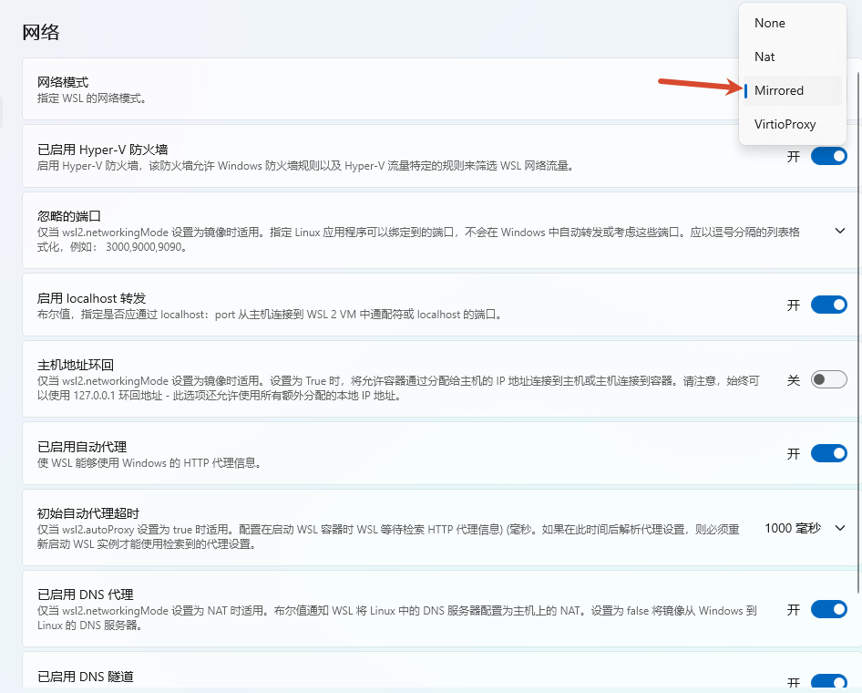
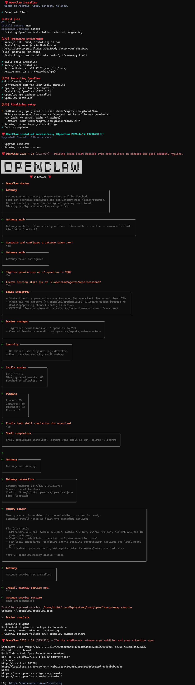

## OpenClaw相关资料
- [OpenClaw源码](https://github.com/openclaw/openclaw)
- [OpenClaw官网](https://openclaw.ai/)


## 安装
### windows
```bash
irm https://openclaw.ai/install.ps1 | iex
```
### ubuntu
- ubuntu VPN设置（略）

- wsl网络设置

    

- 安装命令和过程
    ```bash
    ## 测试网络
    curl www.google.com
    ## 正式安装
    curl -fsSL https://openclaw.ai/install.sh | bash

    npm install -g openclaw #npm安装
    ```

  

- OpenClaw操作
```bash
openclaw gateway #打开
openclaw gateway stop #关闭
systemctl --user stop openclaw-gateway.service #service方式，关闭

openclaw dashboard #获取ui地址
openclaw onboard  #配置模型

openclaw logs
```
## 自动切换大模型

## FAQ
### 1. gateway异常
### 2,