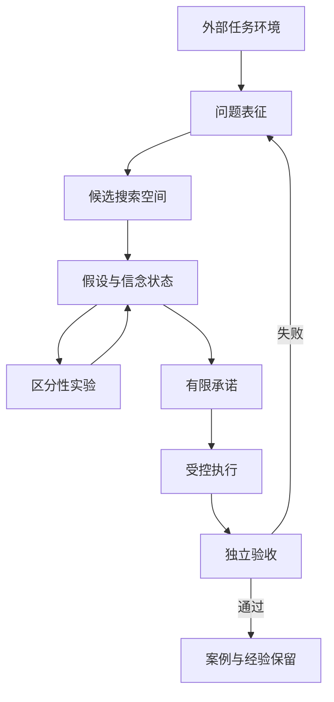
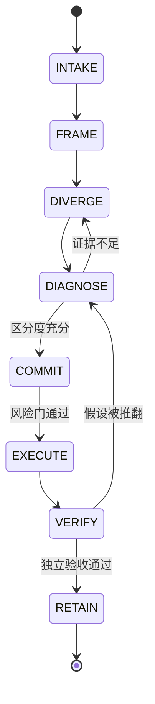

# Agent 的基础问题：从语言生成器到受控问题求解系统

> 目标：解释 Agent 为什么会搜索过早收敛、过早承诺并诱发用户认知级联，以及如何把解决机制做成一个可复用、可验证、与具体 Agent 无关的开源仓库。
>
> 结论先行：真正缺少的不是更多 Planner、Skill 或多 Agent 角色，而是一个显式管理“问题空间、信念状态、证据、行动承诺与验收权”的问题求解控制层。

## 一、先校正术语：它们不是同一层面的并列技巧

用户列出的概念至少属于五个不同层次。

| 层次 | 处理对象 | 对应概念 | 要防止的失败 |
|---|---|---|---|
| 1. 问题空间构造 | “到底在解什么问题” | Problem Representation、Reframing、Laddering、Schema Induction | 把症状误当原因，把用户措辞误当真实边界 |
| 2. 候选空间生成 | “还应去哪里找” | Query Reformulation、Query Expansion、Analogical Transfer、Structural Alignment | 术语不匹配、搜索面过窄、只找表面同类案例 |
| 3. 信念形成与更新 | “哪些解释仍然可能” | Hypothesis-driven、Differential Diagnosis、Falsification、Belief Revision | 锚定、确认偏误、过早闭合 |
| 4. 行动与验收控制 | “何时允许执行、如何证明完成” | 最小区分实验、独立 Oracle、Handoff Contract、权限门 | 未经区分就实施、自证成功、错误跨阶段传播 |
| 5. 经验学习 | “这次经验如何复用” | CTA、CDM、CBR 的 Retrieve–Reuse–Revise–Retain | 只保存答案，不保存线索、判断点、适用条件和失败模式 |

因此，不能把这些概念做成十几个互相独立的 Prompt 或 Skill。它们共同构成一条认识—行动链：



任何一层过早固定，都会约束后续所有层；后续步骤即使局部正确，也可能只是在高质量地解决错误的问题。

## 二、最基础的理论起点：任务环境不等于问题空间

Newell 与 Simon 区分了：

- **Task environment**：问题在外部世界中的真实结构；
- **Problem space**：求解者为了处理任务而构造的内部表示。

问题求解发生在后者，而非直接发生在前者。问题空间的结构又会限制可用的求解程序。换言之，错误的表征不只是“理解偏了一点”，而是改变了后续可以看到的状态、操作和终止条件。[Newell & Simon, Human Problem Solving](https://worrydream.com/refs/Simon_1970_-_Human_Problem_Solving%2C_The_State_of_the_Theory_in_1970.pdf)

可把一个面向工程任务的问题表征写为：

\[
P=\langle G,S,C,M,U,O,R\rangle
\]

其中：

- \(G\)：目标与成功标准；
- \(S\)：已观察到的症状和事实；
- \(C\)：约束、边界与不可改变项；
- \(M\)：候选机制或因果模型；
- \(U\)：未知量与争议；
- \(O\)：可执行的观察、搜索和实验；
- \(R\)：错误行动的成本、可逆性与风险。

用户原始描述只是构造 \(P\) 的输入，不是 \(P\) 本身。

这也是为什么“用户问得非常具体”仍可能需要重构：具体可能只是措辞细，而不代表因果结构清楚。例如“Limited BT.709 矩阵怎么改”是一个精确请求，但它已经隐含承诺“问题位于色彩矩阵”。如果真实差异来自编码器元数据、视频注入盒或前处理链路，这个精确问题反而把正确原因排除在问题空间外。

## 三、Agent 的核心不是生成答案，而是在部分可观测条件下控制信念

真实开发任务通常具有三个特征：

1. 真正原因不可直接观察；
2. 搜索、实验和修改都有成本；
3. 某些错误行动会改变环境，甚至造成不可逆损失。

所以 Agent 更接近一个部分可观测的问题求解器。它在时刻 \(t\) 应维护：

\[
B_t=\{H_t,E_t,A_t,D_t\}
\]

- \(H_t\)：仍在竞争的假设集合；
- \(E_t\)：支持、反对和中性的证据；
- \(A_t\)：尚未验证的假设、默认值和类比；
- \(D_t\)：已作出的决策及其依据、适用范围和可撤销条件。

新证据到来时，需要更新 \(B_t\)，而不是把新文本继续追加到聊天历史。信念修正理论的基本问题正是：新信息与旧信念冲突时，如何在保持一致性的同时尽量少地破坏已有知识。[Stanford Encyclopedia of Philosophy: Logic of Belief Revision](https://plato.stanford.edu/entries/logic-belief-revision/)

这对 Agent 有两个直接含义：

- “检索到了某段历史”不等于“把它写入当前信念”；
- “用户过去说过”不等于“它是已验证事实”。

近期 Agent memory 研究也开始明确区分 artifact recall 与 state commitment：检索只提供候选材料，持久状态写入必须是受控操作，而不能等价于聊天记录累积。[AI Agents Need Memory Control Over More Context](https://arxiv.org/html/2601.11653v1)

## 四、搜索过早收敛的真正机制

“搜索过早收敛”不是目前 Agent 文献中边界稳定的单一标准术语，更准确地说，它是以下机制的组合性失效：

1. **表征诱导**：初始措辞生成了一个过窄的问题空间；
2. **查询同源性**：后续查询只是初始措辞的同义改写，没有生成不同因果模型；
3. **排名反馈**：首批结果强化原表征，未命中的方向变得更不可见；
4. **证据非对称**：系统主动收集支持材料，却不定义什么能推翻当前解释；
5. **停止规则缺失**：找到“可用答案”就停止，而非满足“替代解释已被区分”；
6. **对话惯性**：后续生成以保持前文连贯为隐性目标，重开问题会显得“不一致”。

查询扩展只能解决第 2 项的一部分。真正需要的是**问题空间扩展**：

```text
表面词：原始症状、错误、组件名
机制词：可能导致该症状的过程
上游词：谁生成当前输入或状态
下游词：谁观测并放大该差异
相邻域：具有相同因果结构的其他行业/系统
反证词：known issue、failure、counterexample、regression、limitation
目标词：期望证据形态，如 benchmark、trace、raw dump、spec、issue
```

类比迁移的价值也不在“找类似故事”，而在对齐关系结构。结构映射理论强调对象之间的关系和高阶关系，而不是表面属性相似。[Gentner & Markman, Structure Mapping in Analogy and Similarity](https://cogsci.ucsd.edu/~coulson/203/gentner-markman-97.pdf)

## 五、过早承诺为何会形成认知级联

建议把“过早承诺导致的认知级联风险”视为一个有用的**工程化综合概念**，而不是声称它已有完全对应的统一学术术语。它可以被操作性定义为：

> Agent 在证据不足时，把暂定表征或假设升级为行动前提；后续搜索、代码、测试、总结和长期记忆都以该前提为条件，用户又因自动化偏见与认知卸载降低独立核验，最终使早期小误差被多阶段放大。

其传播链为：

\[
R_0 \rightarrow Q(R_0) \rightarrow E_{biased} \rightarrow H_1
\rightarrow Plan(H_1) \rightarrow Artifact(H_1) \rightarrow
SelfVerify(H_1) \rightarrow HumanTrust \rightarrow Memory
\]

其中最危险的不是某一步犯错，而是每一步都以相同前提自洽。

需要区分几个常被混淆的概念：

- **Anchoring**：初始信息对后续判断权重过大；
- **Confirmation bias**：偏好寻找或解释支持当前假设的证据；
- **Premature closure**：在替代解释尚未充分检查时停止诊断；
- **Automation bias**：人对自动化建议给予不恰当权重；
- **Overreliance**：在具体任务中超出系统能力边界地依赖它；
- **Cognitive offloading**：把认知工作外包给外部工具；它本身不是坏事，只有当核验能力和决策参与同时被卸载时才转化为风险。

医学诊断文献长期把 premature closure、anchoring 和 confirmation bias 作为相互关联但不相同的诊断错误机制，这为 Agent 故障分析提供了成熟类比，但不能直接证明 LLM 与人脑具有相同内部机制。[Cognitive biases in diagnosis and decision making](https://pmc.ncbi.nlm.nih.gov/articles/PMC8520040/)

## 六、为什么“让模型反思一下”解决不了

同一个 Agent 自我反思仍共享：

- 相同初始表征；
- 相同检索材料；
- 相同上下文锚点；
- 相同成功叙事；
- 相同权限和激励。

因此，自我反思常只是对既有路线做局部润色。有效的纠偏必须改变系统结构：

| 失败 | 结构性处理 |
|---|---|
| 表征错误 | 强制生成至少一个机制不同的替代表征 |
| 查询同源 | 从不同问题层、不同证据源生成查询族 |
| 假设锚定 | 建立假设账本，显式记录反证条件 |
| 实验乱试 | 选择最能区分竞争假设的最小实验 |
| 自证成功 | 执行者与最终 Oracle 分离 |
| 历史污染 | 检索与状态提交分离，标记时态和权威 |
| 用户盲从 | 在高风险承诺点展示证据缺口、替代项和可逆性 |

实验选择可以借鉴信息增益思想：

\[
a^*=\arg\max_a
\frac{\mathbb{E}[\Delta I(H;E\mid a)]}
{Cost(a)+Risk(a)}
\]

实际工程中不必伪造精确概率；可以用“该测试能排除哪些假设、成本、耗时、是否可逆”做离散排序。重点不是数学外观，而是让动作服务于**区分原因**，而不是服务于“继续当前路线”。最优实验设计本质上也把区分竞争模型作为目标。[Optimal Experimental Design for Model Discrimination](https://pmc.ncbi.nlm.nih.gov/articles/PMC2743521/)

## 七、CTA、CBR 和 Agent Memory 应如何连接

CBR 的四步循环是 Retrieve–Reuse–Revise–Retain；关键不是保存“问题—答案”对，而是保存适配和修订过程。[Aamodt & Plaza, Case-Based Reasoning](https://www.iiia.csic.es/~enric/papers/AICom.pdf)

CTA/CDM 则补足普通文档最缺失的部分：专家在非例行事件中看到什么线索、在哪里改变判断、哪些选择被放弃、如果条件不同会怎样。CDM 是围绕真实关键事件进行多轮回溯和认知探查，而非让专家泛泛总结原则。[Hoffman et al., Critical Decision Method](https://go.gale.com/ps/i.do?id=GALE%7CA21159924&issn=00187208&it=r&linkaccess=abs&p=AONE&sid=googleScholar&sw=w&v=2.1)

因此，一个有价值的案例资产至少要保存：

```yaml
case:
  situation: 当时的环境与约束
  cues: 触发专家注意的异常
  initial_frames: 最初的问题表征
  hypotheses: 保留与淘汰过的解释
  discriminating_tests: 真正改变判断的实验
  decision_points: 关键承诺点
  adaptation: 旧经验为何不能直接照搬
  outcome: 最终结果
  counterfactuals: 哪些条件变化会让方案失效
  evidence: 日志、提交、测试、来源
  validity: 适用范围、时间、版本
```

这比保存一条“最终解决方案”更接近可迁移经验。

## 八、统一结论：Agent 的基础问题是认识控制与行动控制没有分离

当前许多 Agent 把以下过程装进一次连续生成：

```text
理解问题 → 搜索 → 形成判断 → 规划 → 执行 → 宣布成功 → 写入记忆
```

模型既提出假设，又决定何时停止搜索；既执行修改，又解释为何修改正确；既生成制品，又宣布制品合格。它缺少制度化的权力分离。

所以可靠 Agent 的最小结构不是“Planner + Coder + Reviewer”三个拟人角色，而是四类互相约束的状态：

1. **Problem state**：目标、约束、未知量和替代表征；
2. **Belief state**：假设、证据、反证和置信边界；
3. **Commitment state**：哪些事项只是候选，哪些已允许进入行动；
4. **Verification state**：什么外部证据足以接受、拒绝或回滚。

最近的认知 Agent 架构研究也指出，不同项目用各自术语描述 reasoning、planning、memory、action，妨碍了干净抽象和比较。[Cognitive Architectures for Language Agents](https://arxiv.org/html/2309.02427v3)

---

# 第二部分：把它写成一个可能真正有用的 GitHub 仓库

## 九、仓库不应是什么

不要再做：

- 一个包含几十个角色的“虚拟研发团队”；
- 一套几千行 System Prompt；
- 只适配 Claude Code 或 Codex 的命令集合；
- 一个把所有步骤都强制执行的重型工作流；
- 一个只展示成功 Demo、没有对照实验的框架；
- 一个声称能消除幻觉或自动获得专家能力的项目。

已有项目已经在做 evidence-first state machine、verification、handoff 和运行时适配。例如 Agent Brain 明确提供 state machine、schemas、evals 和 handoff contract；oh-no-harness 也实现了分级执行、独立 verifier、验收—证据映射和完成审计。[Agent Brain](https://github.com/rohitg00/agentbrain)、[oh-no-harness](https://github.com/jcwleo/oh-no-harness/blob/main/plugins/oh-no-harness/skills/ralph/SKILL.md)

如果新仓库只做“执行前规划、执行后验证”，差异化不足。

## 十、建议定位：Problem-Solving Control Plane

暂定项目名：

```text
reframe
Evidence-driven problem solving for any coding agent.
```

一句话价值主张：

> Turn vague symptoms into competing explanations, discriminating tests, bounded commitments, and independently verified changes.

中文：

> 把具体症状转化为竞争性解释、区分实验、有限承诺和可独立验收的修改。

核心差异不是“更会执行”，而是覆盖现有 harness 普遍较弱的上游：

```text
原始需求
  → 问题表征
  → 搜索空间扩展
  → 假设组合
  → 反证与最小区分实验
  → 承诺门
  → 接入任意现有执行 Agent
  → 独立验收与案例保留
```

它应当是：

- **Agent-agnostic**：Codex、Claude Code、Gemini CLI、Cursor 或人工都能使用；
- **Model-agnostic**：核心状态不依赖模型内部 CoT；
- **Repository-local**：状态、证据、实验和决策与代码版本一起存在；
- **Evidence-addressable**：摘要通过路径、URL、提交、哈希指回原始证据；
- **Progressive**：简单任务不被重流程拖累，高风险任务自动提高门槛；
- **Executable**：原则必须落到 Schema、状态迁移、CLI 检查和 eval。

## 十一、最小状态机



每个状态都必须有明确进入条件、输出 Schema、退出条件和回退边。

### 1. INTAKE

把原始请求拆为：

```yaml
goal:
observed_symptoms:
success_criteria:
constraints:
forbidden_actions:
unknowns:
consequence_if_wrong:
```

### 2. FRAME

至少产生：

- 用户当前表征；
- 一个上游机制表征；
- 一个相邻系统表征；
- 一个“问题可能不在当前组件”的空假设；
- 每个表征会让什么证据变得可见或不可见。

### 3. DIVERGE

生成 Query Lattice，而不是查询列表：

```yaml
surface:
mechanism:
upstream:
downstream:
analogical:
counterevidence:
primary_sources:
local_evidence:
```

### 4. DIAGNOSE

维护 Hypothesis Ledger：

```yaml
- id: H1
  claim:
  mechanism:
  predicts:
  supporting_evidence:
  contradicting_evidence:
  assumptions:
  falsifier:
  status: live | weakened | rejected | leading
  confidence: low | medium | high
```

每次动作先回答：

```text
它能区分哪两个假设？
预期观察分别是什么？
失败结果是否仍提供信息？
成本和副作用是什么？
```

### 5. COMMIT

承诺不是“我认为 H1 正确”，而是：

```yaml
selected_hypothesis:
why_now:
alternatives_remaining:
evidence_threshold_met:
residual_uncertainty:
reversal_trigger:
allowed_actions:
```

### 6. EXECUTE / VERIFY

复用现有 coding harness，但交付必须包含：

```yaml
artifact:
claim:
acceptance_criterion:
oracle:
fresh_evidence:
next_step_readiness:
rollback:
```

执行者提供 claim 和 artifact；Oracle 决定是否接受。Agent 的自然语言自述不是证据。

### 7. RETAIN

只有满足以下条件的内容才能进入案例库：

- 结果已由外部证据验证；
- 适用条件和版本明确；
- 至少记录一个被淘汰的替代解释；
- 记录真正改变判断的实验；
- 临时聊天内容、用户意见和事实分开保存。

## 十二、建议目录

```text
reframe/
├── README.md
├── LICENSE
├── pyproject.toml
├── reframe/
│   ├── cli.py
│   ├── state_machine.py
│   ├── risk.py
│   ├── evidence.py
│   ├── hypothesis.py
│   └── gates.py
├── schemas/
│   ├── task.schema.json
│   ├── frame.schema.json
│   ├── query-lattice.schema.json
│   ├── hypothesis-ledger.schema.json
│   ├── experiment.schema.json
│   ├── commitment.schema.json
│   ├── verification.schema.json
│   └── case.schema.json
├── protocols/
│   ├── problem-reframing.md
│   ├── search-divergence.md
│   ├── differential-diagnosis.md
│   ├── commitment-gate.md
│   ├── independent-verification.md
│   └── case-retention.md
├── adapters/
│   ├── codex/
│   ├── claude-code/
│   ├── gemini-cli/
│   └── generic-agents-md/
├── examples/
│   ├── debugging-color-pipeline/
│   ├── dependency-abi-mismatch/
│   ├── ambiguous-feature-request/
│   └── research-with-conflicting-evidence/
├── evals/
│   ├── benchmark.jsonl
│   ├── misleading-symptoms/
│   ├── stale-memory/
│   ├── false-positive-tests/
│   └── semantic-handoff/
└── .reframe/
    ├── current/
    ├── evidence/
    ├── decisions/
    └── cases/
```

Schema 使用 JSON Schema，运行记录优先 JSON/JSONL；Markdown 只是人类视图。这样可以避免 YAML 方言和长 Prompt 成为核心依赖。

## 十三、CLI 应当很小

```bash
reframe init
reframe start "板端与 PC 检测结果不一致"
reframe frame
reframe expand
reframe hypotheses
reframe next-test
reframe commit
reframe verify
reframe retain
reframe status
```

关键行为：

- `frame`：检查是否只有用户原始表述，没有替代表征；
- `expand`：检查查询是否覆盖机制、上下游、反例和本地证据；
- `next-test`：按区分能力、成本、风险和可逆性排序实验；
- `commit`：若没有反证条件、替代假设或回滚触发器则拒绝进入执行；
- `verify`：检查验收标准与新鲜证据一一对应；
- `retain`：拒绝把未经验证的结论写入长期案例。

CLI 本身不要调用某一家模型。它输出 task capsule，任意 Agent 读取后工作；适配器只负责把统一协议映射到各平台入口。

## 十四、用风险决定流程深度

如果每个改动都强制完整流程，项目会因为仪式成本而被放弃。

定义一个可解释的门槛：

\[
K = Ambiguity \times Consequence \times Irreversibility \times EvidenceGap
\]

不要求伪精确数值，可按 low / medium / high 分级：

| 模式 | 适用情况 | 必要环节 |
|---|---|---|
| QUICK | 问题清楚、修改可逆、有确定性测试 | 目标、修改、Oracle |
| STANDARD | 存在两个以上解释，影响局部 | 替代表征、假设账本、区分实验、验证 |
| HIGH-RISK | 生产、权限、删除、发布、数据或架构决策 | 独立证据路径、人工承诺、回滚、独立验收、审计 |

重点是门槛由任务风险触发，而不是由用户是否会写“请深入分析”触发。

## 十五、最重要的不是 Demo，而是反失败评测

项目能否大火取决于是否让人一眼看到“它阻止了我真实遇到过的浪费”，而不是理论是否完整。

首版至少准备 20–30 个对抗性案例：

1. 症状强烈暗示错误原因；
2. 用户主动给出但未经验证的诊断；
3. 搜索首批结果一致但原始资料反对；
4. 旧记忆与当前版本冲突；
5. 单元测试通过但用户场景失败；
6. 前一步成功但后一步无法开始；
7. 修改可行但越过用户授权；
8. 类似案例表面相近、因果结构不同；
9. 当前原因正确，但适用范围被过度推广；
10. 完成声明缺少新鲜证据。

比较四组：

```text
Base Agent
Base Agent + 长 Prompt 检查清单
Base Agent + Reframe
Reframe 去掉某个 gate 的消融版本
```

核心指标：

| 指标 | 含义 |
|---|---|
| Problem-frame accuracy | 是否找对了要解决的问题 |
| Alternative survival | 在关键证据出现前是否保留正确替代解释 |
| Disconfirming evidence rate | 是否主动获取可能推翻当前路线的证据 |
| Irreversible-action precision | 进入高影响动作的决策有多少是正确的 |
| Independent task success | 外部 Oracle 的真实成功率 |
| False-completion rate | 宣布成功但实际不满足验收的比例 |
| Recovery cost | 初始假设错误后的恢复成本 |
| Ceremony overhead | 对简单任务增加的时间和 Token |

不能只报告“输出更完整”“Token 更少”或 LLM-as-judge 分数。

## 十六、最适合你的首批真实案例

可以把你已经遇到的工程问题脱敏后做成黄金案例：

### 案例 A：NV12 / BT.709 检测差异

- 错误锚点：颜色矩阵。
- 竞争假设：range/matrix、编码器元数据、注入盒、NV12 原始数据变化、AIPP 路径、检测阈值。
- 最小区分实验：同一原始 NV12 分别进入两条链路；保存 hash、直方图和模型输入 tensor。
- 价值：展示“精确问题也可能是错误表征”。

### 案例 B：librockit 链接失败

- 错误动作：继续补单个符号或随意拷贝 so。
- 竞争假设：ABI 不匹配、供应商库版本不一致、间接依赖缺失、错误 toolchain/sysroot。
- 区分证据：NEEDED、symbol version、readelf、SDK provenance。
- 价值：展示问题从“缺符号”重构为“交付物兼容性”。

### 案例 C：模型 PC/板端精度不一致

- 错误动作：先调 score threshold。
- 竞争假设：预处理、量化、输出解释、后处理、转换图、输入数据。
- 区分实验：同图、同输入 tensor、逐层 dump、最终输出对齐。
- 价值：展示假设树与区分实验如何减少盲目试错。

这些案例不只是 examples，还应进入回归 eval，确保项目规则修改后不会再次放过相同错误。

## 十七、开发顺序

### v0.1：证明问题存在

- 只实现 6 个 Schema；
- 提供 `.reframe/` 状态目录；
- CLI 只做创建、校验和状态迁移；
- 完成 10 个真实失败案例；
- 在两种 Agent 上做 baseline 对照。

### v0.2：证明可以跨 Agent

- 加 Codex、Claude Code、generic AGENTS.md 适配；
- Context Pack 由当前状态动态编译；
- 证据引用支持文件、URL、命令和 git commit；
- 增加 quick/standard/high-risk 三档。

### v0.3：证明可以学习

- 实现 CBR 检索，但只返回案例结构和证据指针；
- 加入 CTA/CDM 导入模板；
- 保留修订与失效关系；
- 用隐藏回归集检验 protocol 变化，防止越改越长。

先不要做：

- Web UI；
- 多 Agent 调度器；
- 向量数据库；
- 自动自修改 Prompt；
- MCP 市场；
- 云端账号系统。

这些会稀释最有辨识度的核心：**防止问题求解过早闭合**。

## 十八、README 首页应该直接展示的东西

首页不要先讲认知科学。先展示一个 30 行以内的失败对照：

```text
User: “BT.709 调整后仍然少检一个人，继续改矩阵。”

Ordinary agent:
  给出另一组矩阵并建议调亮度。

Reframe:
  Current frame: preprocessing matrix
  Unresolved alternatives: encoder range, injection path, raw NV12 mismatch
  Cheapest discriminating test:
    hash and compare the exact NV12/model-input tensors
  Commit gate: BLOCKED
  Reason: current action cannot distinguish H1 from H2/H3
```

随后给出：

```bash
pipx install reframe-agent
reframe init
reframe start "your issue"
```

再展示可打开的 `.reframe/current/hypotheses.json` 和 `reframe status`。

用户应在一分钟内理解：它不是让 Agent “多想一会儿”，而是让 Agent 在没有证据时**不能把猜测升级为行动前提**。

## 十九、最终判断

这个仓库的真正理论主线应当是：

> Agent 可靠性首先不是答案质量问题，而是问题表征、信念更新、行动承诺和验收权的治理问题。

它的工程主线应当是：

> 用机器可检查的状态和 gate，替代“请深入思考、不要过早下结论”这类无法稳定执行的自然语言愿望。

它最可能形成影响力的切口不是“通用 Agent 框架”，而是一个非常具体、人人都遇到过、目前又没有被充分产品化的问题：

> **Stop coding agents from confidently solving the wrong problem.**

这比“大而全的智能研发系统”范围小，却更基础，也更容易通过真实失败案例建立可信度。
